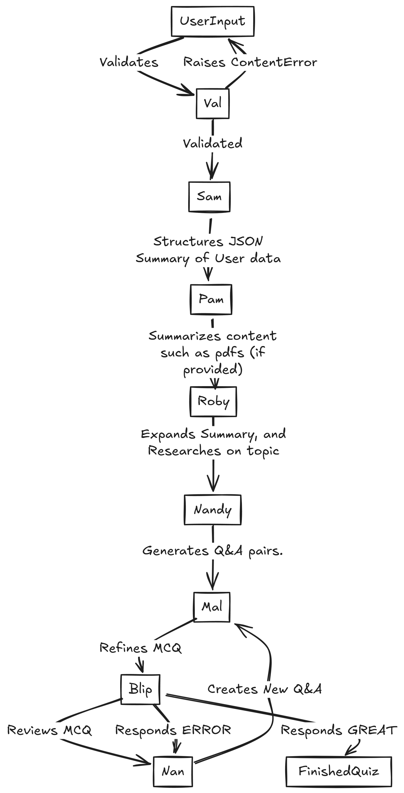

# Quazar

**Live Demo:** https://quazar--quazarai.us-central1.hosted.app/

Quazar is an open-source, hackathon-born web app that uses a chain of LLM-powered agents to generate and host live, interactive multiplayer quizzes—no manual question writing required.

---

## 🚀 Features
- **Quiz Generation:** Generate multiple choice questins on any topic, in under a minute (per quiz), using multiple Agents, that verifies input, summarizes it, researches about a topic, creates questions, and         
  validates them (explained more in details below).
- **Multiplayer Gameplay:** Host games, join via room code, real-time leaderboards, and most importantly, learn and have fun!
- **Quiz Analytics**: Easily get detailed analytics generated from your games, made for teachers who want to know how well did their quiz go.
  the analytics can be easily summarized into conclusions, by clicking on the *AI summary button*.
- **Edit Quizzes**: Modify, delete, or add questions, it's self-explanatory.

---

## 🔍 Architecture
The architecture behind the generation of the quizzes!

| Agent  | Role                                                                 |
|--------|----------------------------------------------------------------------|
| **Val**  | Validates inputs; rejects NSFW/dangerous/gibberish with `ContentError`. |
| **Sam**  | Structures your topic/details into a strict JSON schema.            |
| **Pam**  | (Optional) Summarizes any uploaded PDFs or docs.                    |
| **Roby** | Enriches Sam’s skeleton with background research and key concepts.  |
| **Nandy**| Generates the initial set of Q&A pairs (exactly as many as you request). |
| **Mal**  | Polishes each into a timed MCQ with three distractors.              |
| **Blip** | Reviews clarity & audience fit—flags errors for regeneration.      |
| **Nan**  | Fallback: replaces any flagged question with a fresh one.           |

---

## 🎮 Multiplayer Game Flow

1. **Host** generates a room code—players join via that code.  
2. **Host** starts the quiz; all clients receive the first question.  
3. **Players** answer; responses are time-stamped and scored by speed + correctness.  
4. After each question, a **leaderboard** updates in real time.  
5. At the end, the **top 3** players are highlighted.

---

Made with ❤️ by ZOP 
Submitted to the [AlgoArena Hackathon](https://algoarena.devpost.com/)  
