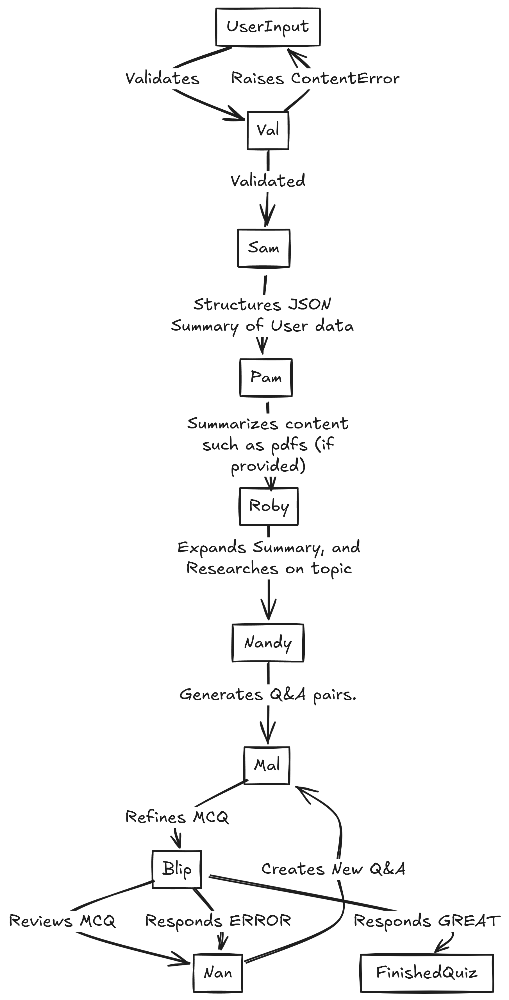

# Quazar

**Live Demo:** https://quazarai.com

Quazar is an open-source, hackathon-born web app that uses a chain of LLM-powered agents to generate and host live, interactive multiplayer quizzes—no manual question writing required.

---

## 🚀 Features

- **Instant Quiz Creation:** Streamed, real-time generation of multiple choice questins on any topic.  
- **Agent Pipeline:** NSFW‐safe input validation through to polished, reviewed questions  
- **Multiplayer Gameplay:** Host games, join via room code, real-time leaderboards  
- **PDF Support:** Upload course notes or papers for in-depth content summaries  

---

## 🔍 Architecture

Below is the chain of agents that turn your prompt into a finished quiz:

| Agent  | Role                                                                 |
|--------|----------------------------------------------------------------------|
| **Val**  | Validates inputs; rejects NSFW/dangerous/gibberish with `ContentError`. |
| **Sam**  | Structures your topic/details into a strict JSON schema.            |
| **Pam**  | (Optional) Summarizes any uploaded PDFs or docs.                    |
| **Roby** | Enriches Sam’s skeleton with background research and key concepts.  |
| **Nandy**| Generates the initial set of Q&A pairs (exactly as many as you request). |
| **Mal**  | Polishes each into a timed MCQ with three distractors.              |
| **Blip** | Reviews clarity & audience fit—flags errors for regeneration.      |
| **Nan**  | Fallback: replaces any flagged question with a fresh one.           |

---

## 🎮 Multiplayer Game Flow

1. **Host** generates a room code—players join via that code.  
2. **Host** starts the quiz; all clients receive the first question.  
3. **Players** answer; responses are time-stamped and scored by speed + correctness.  
4. After each question, a **leaderboard** updates in real time.  
5. At the end, the **top 3** players are highlighted.

---

Made with ❤️ by ZOP 
Submitted to the [AlgoArena Hackathon](https://algoarena.devpost.com/)  
